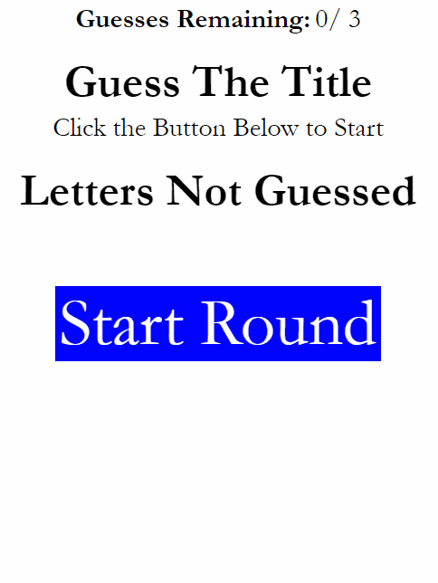

# Guess the Letters
Creating a version of the hang man game to practice frontend and backend.

## Description 
I created this app to practice creating a full-stack app. The app has the player guess letters to complete the title of a movie. The movie title comes from OMDB, an open api database. The title, letters to guess, guess count, and round id are all stored in a database. The user's guesses are checked on the backend and the backend creates the html that is used to display the main game display, which updates everytime the user guesses correctly. The frontend is used to perform get and put requests to the backend. The site is currently being hosted on Heroku and the database is on Jaws. Axios, Express, and Sequelize (dialect mysql) are some of the major npms used.

## Live site: 
https://guess-the-letters.herokuapp.com/

## Images
GIF of app functioning:

## Installation 
You will need to npm init to get all the required node modules. If you are running the code locally the local host is set to port 3000. You will also need to go in to the config folder and possibly change the config.json values. The file I used to start the project is server.js.

## Usage 
The primary purpose of this was to practice making a fullstack application for the first time on my own. You could use it to continue trying to guess Star Wars movie titles.

## Credits 
I created this code based on the a challenge set for me by my fantastic TA Bryan Bloomquist(bryanbloomquist). Certain pieces of code I used online resources for help. I have included citations in the form of comments throughout the code. In addition, I would not posses 99% of the skillz required for this project without the teachings of my instructor Brian Bartholomew (bcbrian).

## Contributing 
I am currently the sole contributor to this repository.

## Challenges
The major challenges were around figuring out MVC. I am still struggling with where to put code in terms of the backend vs the frontend. Then, when you figure that part out, how do you organize the code in the respective ends. As always, there were some struggles with getting the html to look okay on both mobile and larger screens.

## Future Updates
* Make the code DRY. There are currently several instances where the same code is repeated or where too much code is in a single file.
* Add more titles to guess from
* Make it so you can keep guessing additional titles to increase a score
* Create a leaderboard for the top scores

## License
[MIT](https://choosealicense.com/licenses/mit/)
